# Finish Finder Architecture Diagrams

This document contains Mermaid diagrams visualizing the system architecture, data flows, and component relationships.

---

## System Architecture Overview

```mermaid
graph TB
    subgraph "Frontend (Vercel)"
        UI[Next.js 16 App]
        UI --> |SSR/CSR| Pages[React 19 Pages]
        Pages --> |components| Components[UI Components]
    end

    subgraph "API Layer (Next.js API Routes)"
        Events[/api/db-events]
        Health[/api/health]
        Perf[/api/performance]
        Ingest[/api/internal/ingest]
        Admin[/api/admin/wipe-database]
    end

    subgraph "Services Layer"
        UnifiedPred[Unified Prediction Service]
        ScoreCalc[Score Calculator]
        Validator[Consistency Validator]
        Calibration[Calibration Service]
        Embeddings[Embeddings Service]
        HybridSearch[Hybrid Retrieval]
    end

    subgraph "External Services"
        OpenAI[OpenAI API]
        Anthropic[Anthropic API]
        BraveSearch[Brave Search API]
    end

    subgraph "Data Layer"
        Prisma[Prisma ORM]
        PG[(PostgreSQL + pgvector)]
        Monitoring[Query Monitor]
    end

    subgraph "Scraper (Python)"
        Scrapy[Scrapy Spider]
        Parser[HTML Parsers]
        Pipeline[API Pipeline]
        ImageScraper[Image Scraper]
    end

    subgraph "External Data Sources"
        UFCStats[UFCStats.com]
        ESPN[ESPN API]
        Wikipedia[Wikipedia API]
    end

    %% Frontend connections
    Pages --> Events
    Pages --> Health

    %% API connections
    Events --> Prisma
    Health --> Prisma
    Health --> Monitoring
    Perf --> Monitoring
    Ingest --> Prisma
    Admin --> Prisma

    %% Service connections
    UnifiedPred --> OpenAI
    UnifiedPred --> Anthropic
    UnifiedPred --> ScoreCalc
    UnifiedPred --> Validator
    UnifiedPred --> Calibration
    UnifiedPred --> Embeddings
    Embeddings --> OpenAI
    HybridSearch --> PG
    Calibration --> Prisma

    %% Scraper connections
    Scrapy --> Parser
    Parser --> Pipeline
    Pipeline --> Ingest
    Scrapy --> UFCStats
    ImageScraper --> ESPN
    ImageScraper --> Wikipedia

    %% Data layer
    Prisma --> PG
    Monitoring --> PG

    %% Styling
    classDef external fill:#f9f,stroke:#333,stroke-width:2px
    classDef database fill:#69b,stroke:#333,stroke-width:2px
    classDef api fill:#9f9,stroke:#333,stroke-width:2px

    class UFCStats,ESPN,Wikipedia,OpenAI,Anthropic,BraveSearch external
    class PG database
    class Events,Health,Perf,Ingest,Admin api
```

---

## AI Prediction Pipeline


---

## Data Scraping Pipeline


---

## Database Entity Relationship

```mermaid
erDiagram
    Fighter ||--o{ Fight : "fights as fighter1"
    Fighter ||--o{ Fight : "fights as fighter2"
    Fighter ||--o{ FighterContextChunk : "has context"
    Event ||--o{ Fight : "contains"
    Event ||--o{ PredictionUsage : "tracks usage"
    Fight ||--o{ Prediction : "has predictions"
    Fight ||--o| WeakSupervisionLabel : "has label"
    Fight ||--o{ PredictionLog : "has logs"
    PredictionVersion ||--o{ Prediction : "creates"

    Fighter {
        string id PK
        string name
        string record
        int wins
        int losses
        int draws
        string weightClass
        float finishRate
        float koPercentage
        float submissionPercentage
        vector profile_embedding
        tsvector search_vector
    }

    Event {
        string id PK
        string name
        datetime date
        string location
        string venue
        boolean completed
        boolean cancelled
        string sourceUrl UK
    }

    Fight {
        string id PK
        string eventId FK
        string fighter1Id FK
        string fighter2Id FK
        string weightClass
        boolean titleFight
        boolean mainEvent
        int scheduledRounds
        float predictedFunScore
        float finishProbability
        boolean completed
        string winnerId
        string method
        int round
        string time
    }

    Prediction {
        string id PK
        string fightId FK
        string versionId FK
        float finishProbability
        float finishConfidence
        float funScore
        float funConfidence
        json finishReasoning
        json funBreakdown
        string modelUsed
        int tokensUsed
        float costUsd
    }

    PredictionVersion {
        string id PK
        string version UK
        string finishPromptHash
        string funScorePromptHash
        boolean active
        float brierScore
        float funScoreCorrelation
    }

    CalibrationParams {
        string id PK
        string predictionType
        float paramA
        float paramB
        json conformityScores
        float coverageLevel
        int trainedOn
        boolean active
    }

    WeakSupervisionLabel {
        string id PK
        string fightId FK UK
        boolean actualFinish
        string entertainmentLabel
        float entertainmentScore
        float entertainmentConfidence
        string[] contributingFunctions
    }

    FighterContextChunk {
        string id PK
        string fighterId FK
        text content
        string contentType
        vector embedding
        tsvector search_vector
        datetime publishedAt
        datetime expiresAt
    }

    PredictionLog {
        string id PK
        string fightId FK
        float rawFinishProbability
        float calibratedFinishProbability
        int rawFunScore
        float funScoreLower
        float funScoreUpper
        boolean actualFinish
        string actualEntertainment
    }

    PredictionUsage {
        string id PK
        string eventId FK
        int fightsProcessed
        int totalTokensEstimated
    }

    QueryMetric {
        string id PK
        string query
        string model
        string action
        int duration
        string performance
    }

    ScrapeLog {
        string id PK
        datetime startTime
        datetime endTime
        string status
        int eventsFound
        int fightsAdded
        int fightersAdded
    }
```

---

## Frontend Component Hierarchy


---

## Calibration System

```mermaid
flowchart LR
    subgraph Training["Training Phase"]
        Historical[Historical Predictions]
        Outcomes[Fight Outcomes]
        DSPy[DSPy Eval Data<br/>516 fights]
    end

    subgraph PlattTraining["Platt Scaling Training"]
        LogOdds[Transform to Log-Odds]
        GradDesc[Gradient Descent]
        Params[Learn A, B params<br/>A=1.7034, B=-0.4888]
    end

    subgraph ConformalTraining["Conformal Training"]
        Residuals[Calculate Residuals]
        Sort[Sort Conformity Scores]
        Threshold[Compute Threshold<br/>@ 90% coverage]
    end

    subgraph Storage["Storage"]
        CalibDB[(CalibrationParams<br/>Table)]
    end

    subgraph Inference["Inference Phase"]
        RawPred[Raw LLM Prediction]
        ApplyPlatt[Apply Platt Scaling<br/>σ(A·logit(p) + B)]
        ApplyConf[Apply Conformal<br/>±threshold interval]
        Calibrated[Calibrated Output]
    end

    subgraph Monitoring["Monitoring"]
        Metrics[Track Brier, ECE, MCE]
        Report[Calibration Report]
    end

    %% Training flow
    Historical --> LogOdds
    Outcomes --> LogOdds
    DSPy --> LogOdds
    LogOdds --> GradDesc
    GradDesc --> Params
    Params --> CalibDB

    Historical --> Residuals
    Outcomes --> Residuals
    Residuals --> Sort
    Sort --> Threshold
    Threshold --> CalibDB

    %% Inference flow
    RawPred --> ApplyPlatt
    CalibDB --> ApplyPlatt
    ApplyPlatt --> ApplyConf
    CalibDB --> ApplyConf
    ApplyConf --> Calibrated

    %% Monitoring
    Calibrated --> Metrics
    Metrics --> Report

    %% Styling
    classDef training fill:#ffd,stroke:#333
    classDef storage fill:#69b,stroke:#333
    classDef inference fill:#dfd,stroke:#333

    class Historical,Outcomes,DSPy,LogOdds,GradDesc,Params,Residuals,Sort,Threshold training
    class CalibDB storage
    class RawPred,ApplyPlatt,ApplyConf,Calibrated inference
```

---

## Hybrid Retrieval System


---

## GitHub Actions Workflows


---

## Request/Response Flow


---

## Score Calculation Formula

```mermaid
flowchart TD
    subgraph Inputs["LLM Outputs (1-5 scales)"]
        Pace[pace: 1-5]
        Danger[finishDanger: 1-5]
        Tech[technicality: 1-5]
        Style[styleClash: Comp/Neutral/Cancel]
        Brawl[brawlPotential: bool]
    end

    subgraph FinishCalc["Finish Probability Calculation"]
        Baseline[Weight Class Baseline<br/>HW: 0.70, LW: 0.55, etc.]
        DangerMult["finishDangerMultiplier<br/>0.4 + (danger-1) × 0.2"]
        StyleMult["styleMultiplier<br/>Comp: 1.15, Neutral: 1.0, Cancel: 0.75"]
        FinishProd["probability = baseline × dangerMult × styleMult"]
        FinishClamp["Clamp [0.15, 0.85]"]
    end

    subgraph FunCalc["Fun Score Calculation (0-100)"]
        PacePoints["pace_points<br/>(pace-1) × 35/4 = 0-35"]
        DangerPoints["danger_points<br/>(danger-1) × 35/4 = 0-35"]
        TechPoints["tech_points<br/>peaks at 3-4, max 10"]
        BrawlBonus["brawl_bonus<br/>+10 if true"]
        ContextBonus["context_bonus<br/>title: +5, main: +2, rival: +3"]
        CancelPenalty["cancel_penalty<br/>-15 if Canceling"]
        FunSum["Sum all components"]
        FunClamp["Clamp [0, 100]"]
    end

    subgraph ConfCalc["Confidence Adjustment"]
        BaseConf[LLM confidence: 0-1]
        LowPaceBrawl["pace ≤ 2 AND brawl?<br/>-10%"]
        HighPaceCancel["pace ≥ 4 AND Cancel?<br/>-10%"]
        TechBrawl["tech = 5 AND brawl?<br/>-5%"]
        ConfClamp["Clamp [0.3, 1.0]"]
    end

    %% Finish flow
    Pace --> FinishCalc
    Danger --> DangerMult
    Style --> StyleMult
    Baseline --> FinishProd
    DangerMult --> FinishProd
    StyleMult --> FinishProd
    FinishProd --> FinishClamp

    %% Fun flow
    Pace --> PacePoints
    Danger --> DangerPoints
    Tech --> TechPoints
    Brawl --> BrawlBonus
    Style --> CancelPenalty
    PacePoints --> FunSum
    DangerPoints --> FunSum
    TechPoints --> FunSum
    BrawlBonus --> FunSum
    ContextBonus --> FunSum
    CancelPenalty --> FunSum
    FunSum --> FunClamp

    %% Confidence flow
    BaseConf --> LowPaceBrawl
    Pace --> LowPaceBrawl
    Brawl --> LowPaceBrawl
    LowPaceBrawl --> HighPaceCancel
    Style --> HighPaceCancel
    HighPaceCancel --> TechBrawl
    Tech --> TechBrawl
    TechBrawl --> ConfClamp

    %% Styling
    classDef input fill:#ffd,stroke:#333
    classDef calc fill:#dfd,stroke:#333
    classDef output fill:#ddf,stroke:#333

    class Pace,Danger,Tech,Style,Brawl input
    class Baseline,DangerMult,StyleMult,FinishProd,PacePoints,DangerPoints,TechPoints,BrawlBonus,ContextBonus,CancelPenalty,FunSum,BaseConf,LowPaceBrawl,HighPaceCancel,TechBrawl calc
    class FinishClamp,FunClamp,ConfClamp output
```



---

## Deployment Architecture


---

## Multi-Persona Prompt Architecture


---

## Notes

- All diagrams use [Mermaid](https://mermaid.js.org/) syntax
- View these diagrams in VS Code with the Mermaid extension or on GitHub
- For interactive viewing, paste code into [Mermaid Live Editor](https://mermaid.live/)

---

**Last Updated:** 2026-01-05
